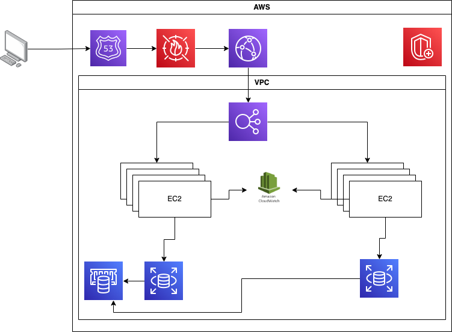

# Arquitectura

## Explicación
1. Servicios DNS con Amazon Route 53: Proporciona servicios DNS para simplificar la gestión de dominios.

2. Seguridad en el borde para Amazon CloudFront con AWS WAF: Filtra tráfico malicioso, incluyendo scripting entre sitios (XSS) e inyección SQL mediante reglas definidas por el cliente.

3. Caché en el borde con Amazon CloudFront: Almacena en caché contenido de alto volumen para disminuir la latencia hacia los clientes.

4. Balanceo de carga con Elastic Load Balancing (ELB): Permite repartir la carga a través de múltiples Zonas de Disponibilidad y grupos de Auto Scaling de Amazon EC2 para redundancia y desacoplamiento de servicios.

5. Protección DDoS con AWS Shield: Protege automáticamente tu infraestructura contra los ataques DDoS más comunes en las capas de red y transporte.

6. Logs de EC2 con CloudWatch.

7. Base de datos gestionada con Amazon Relational Database Service (Amazon RDS): Crea una arquitectura de base de datos altamente disponible y multi-AZ con seis motores de base de datos posibles.

8. Caché con Amazon ElastiCache: Ofrece servicios de caché con Redis o Memcached para reducir la carga en la aplicación y la base de datos, y disminuir la latencia de solicitudes frecuentes.

## IAM Role
### DeveloperRole

Los desarrolladores necesitan acceso para realizar pruebas y gestión de recursos relacionados a su entorno de desarrollo, sin acceso a configuraciones críticas o datos sensibles.

Acceso de lectura/escritura a buckets de S3: Necesarios para subir y acceder a archivos de prueba.
Permisos en EC2: Crear, iniciar y finalizar instancias de EC2, limitadas a un entorno de prueba específico.
Acceso limitado a CloudWatch: Ver logs y métricas para soluciones de problemas en desarrollo.
Acceso limitado a AWS Elastic Beanstalk o AWS Lambda: Para despliegue y pruebas de aplicaciones.

### AdminRole

Los administradores requieren acceso para configurar y gestionar toda la infraestructura, pero no necesariamente para modificar el código fuente o los datos sensibles de la aplicación.

Permisos completos en IAM: Gestionar roles, usuarios y permisos.
Acceso completo a Amazon VPC: Configurar redes y seguridad.
Permisos completos en EC2 y RDS: Gestionar instancias y bases de datos.
Acceso total a S3 y CloudTrail: Para revisión y auditoría de logs y almacenamiento de datos corporativos.
Acceso a AWS Cost Explorer: Para supervisar y optimizar costos.

###  AppServerRole

Este rol se asigna a los servidores de aplicaciones, limitando el acceso a lo esencial para ejecutar y mantener la aplicación.

Acceso de lectura/escritura a buckets específicos de S3: Para leer o almacenar datos generados por la aplicación.
Acceso limitado a DynamoDB o RDS: Solo operaciones de lectura/escritura necesarias para las transacciones de la aplicación.
Permisos de CloudWatch: Enviar logs y métricas desde los servidores de aplicaciones.
Acceso a Secrets Manager: Obtener credenciales necesarias para acceder a base de datos o APIs.