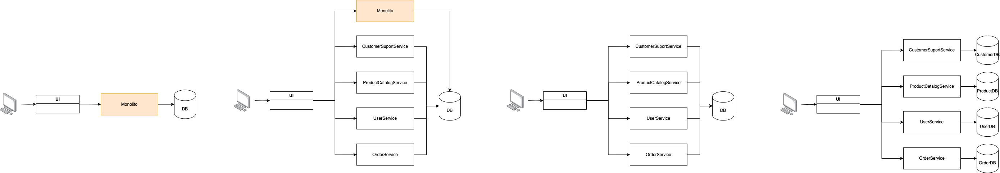

# Esquema de Arquitectura de Microservicios

## Diagrama de la arquitectura propuesta

## Explicación de cómo interactúan los servicios y el flujo de comunicación entre ellos:
1. Se generaron 4 microservicios siguiendo el DDD, cada microservicio con su respectiva BD.
2. La UI se comunicaría con los ms correspondientes.
3. Los microservicios serían tipo REST siguiendo las buenas prácticas del manejo de códigos HTTP para que la UI pueda mostrar los mensajes correspondientes.

# Plan de Migración Detallado (estrangulación progresiva)

## Prioridades de migración de servicios

1. Se extraería primero las operaciones relcionadas con CustomerSupport dado que es una operación poco crítica y con esa se puede experimentar.
2. Como segunda extracción se moverían los servicios relacionados al producto.
3. Se continuaría con las operaciones relacionadas con los usuarios.
4. Finalmente se extraerían las operaciones relacioadas a las órdenes dado que es la operación más crítica.
5. Se generarían logs de cada uno de los servicios migrados.
6. Conforme se generen los ms se redireccionaría al ms.

## Estrategia para manejar dependencias de datos
Se tendría que hacer migración de la BD del monolito y colocar la información correspondiente a cada una de las BD.

## Descripción del proceso de migración de la base de datos monolítica a un entorno de microservicios
Primero coexistiría el monolito con los ms que se van generando, los ms se comunicarían con la BD del monolito y gradualmente se generarían las BD de cada ms.

# Informe de Reflexión
La estrategía de migración se decidió por estrangulamiento para que se pudiera hacer de manera progresiva. Comenzando con ambas arquitecturas coexistiendo y quitando protagonismo al monolito hasta que se pueda prescindir del él. 